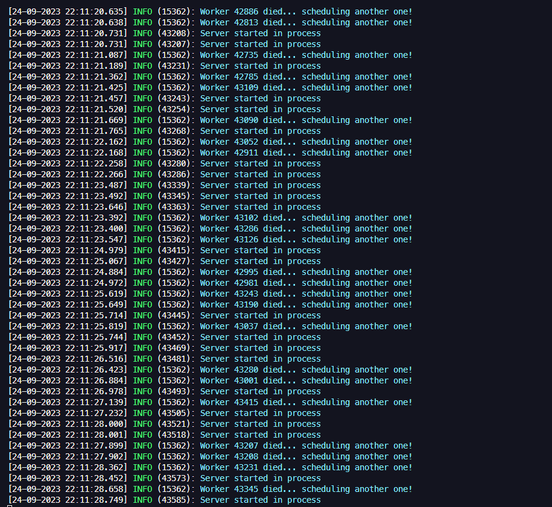

# O que se trata esse repositório

Como trabalhar com os cluster no nodejs em alta performance, caso acontece erros a aplicação automaticamente recria os processos, ou seja aguardar as conexoes serem encerradas para só então encerrar o programa.




1. Clone o repositório do GitHub usando o comando:

```bash
git clone https://github.com/jadilson12/nodejs-cluster-api.git
```

2. Navegue para o diretório raiz do projeto:

```bash
cd nodejs-cluster-api
```

3. Instale as dependências

```bash
pnpm install
```

4. Rodar a app

```bash
pnpm run dev
```

5. Rodar o stress

```bash
pnpm t
```
